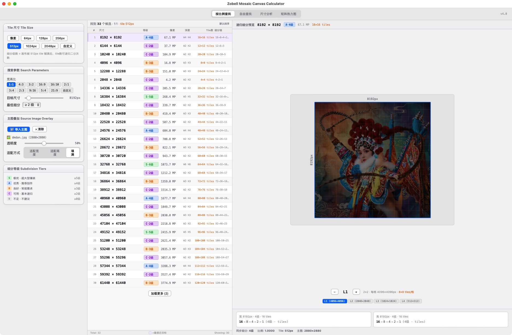
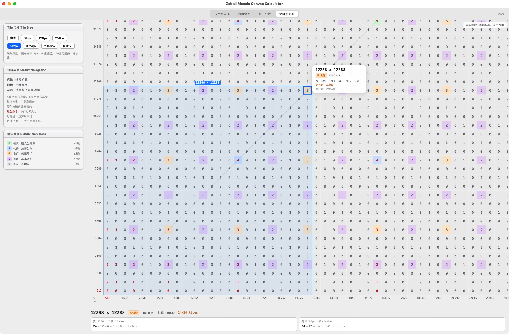

# Zobell Mosaic Canvas Calculator

A professional canvas size calculator for digital mosaic and tile-based artwork, built with React + Vite. Helps artists find optimal canvas dimensions based on tile size, aspect ratio, and recursive subdivision depth.

**Two ways to use:**
- **Browser mode** — works on Windows, macOS, and Linux
- **Desktop mode** — native window app, currently macOS only

## Screenshots





## Features

- **Ratio Search** — Find canvas sizes by aspect ratio (1:1, 4:3, 16:9, etc.) with tile alignment
- **Free Search** — Input custom width/height and find nearby tile-aligned sizes
- **Size Analysis** — Analyze any dimension's subdivision chain and tile compatibility
- **Matrix Heatmap** — Visual heatmap of all width×height combinations colored by subdivision depth
- **Source Image Overlay** — Load a reference image onto the canvas preview
- **Subdivision Tiers** — S/A/B/C/D grading system based on recursive subdivision depth

## Platform Support

| Platform | Browser Mode | Desktop Mode |
|----------|:----------:|:----------:|
| Windows  | Yes | Not yet |
| macOS    | Yes | Yes |
| Linux    | Yes | Not yet |

> Windows and Linux users: please use **Browser mode** for now. Desktop mode currently relies on macOS-specific scripts and pywebview configuration.

## Quick Start — Windows (Browser)

**Prerequisites:** [Node.js](https://nodejs.org/) (v18 or later). Download the LTS version and install with default settings.

1. Open **PowerShell** or **Command Prompt**
2. Navigate to the project folder:
   ```powershell
   cd C:\path\to\zobell-mosaic-canvas
   ```
3. Install dependencies (first time only):
   ```powershell
   npm install
   ```
4. Start the development server:
   ```powershell
   npm run dev
   ```
5. Open the URL shown in the terminal (usually `http://localhost:5173`) in your browser

> **Port conflict?** If port 5173 is already in use, Vite will automatically pick the next available port. Check the terminal output for the actual URL.

## Quick Start — macOS

### Browser Mode

```bash
npm install
npm run dev
```

### Desktop Mode

Runs as a native window via [pywebview](https://pywebview.flowrl.com/).

```bash
# First time setup
npm install
npm run build
python3 -m venv venv
source venv/bin/activate
pip install pywebview

# Run
./start.sh
```

Or double-click `start.command` in Finder.

## Tech Stack

- React 19 + Vite
- pywebview (macOS desktop wrapper)
- Python 3
- Single-file component (`src/canvas-tool.jsx`)

## Project Status

Actively developing. Core features are stable and usable.

## FAQ

**Can I run this on Windows?**
Yes. Use Browser mode — install Node.js, run `npm install && npm run dev`, and open the local URL in your browser.

**Does the desktop app support Windows?**
Not yet. The desktop wrapper currently uses macOS-specific shell scripts and pywebview. Windows desktop support may be added in a future release.

**Which mode should I use first?**
Browser mode. It works on all platforms and gives you the full feature set. Desktop mode is a convenience wrapper for macOS users who prefer a standalone window.

## License

MIT
